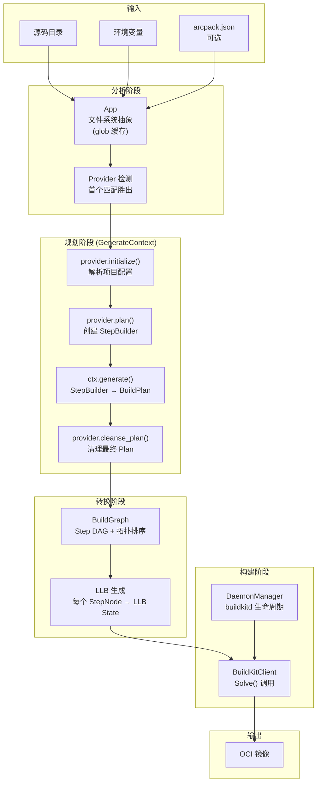
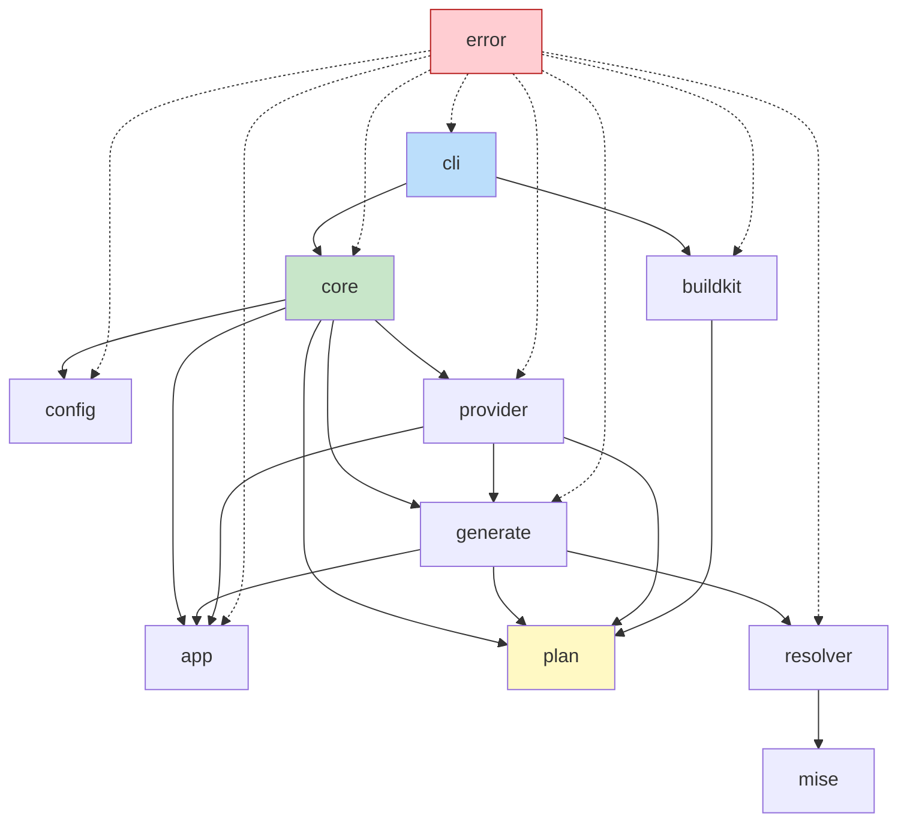
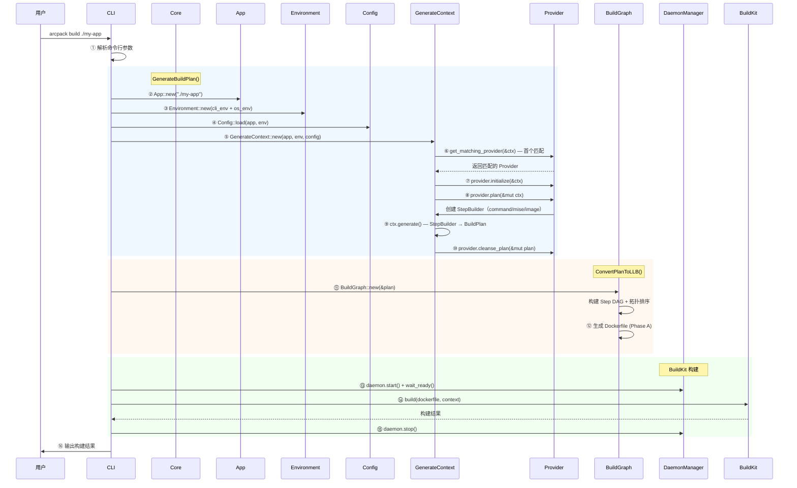

# ArcPack 架构设计 & 技术选型 & 项目脚手架

> 版本：v0.2.0 | 日期：2026-02-26 | 状态：草案
>
> 本文档深度参考 [railpack](https://github.com/railwayapp/railpack) 的实际实现，arcpack 是其 Rust 移植版。

## 目录

- [1. 整体架构设计](#1-整体架构设计)
- [2. 模块划分 & 目录结构](#2-模块划分--目录结构)
- [3. 核心 API 合约](#3-核心-api-合约)
- [4. 技术栈选型](#4-技术栈选型)
- [5. 项目脚手架规划](#5-项目脚手架规划)
- [6. 构建流水线详细流程](#6-构建流水线详细流程)
- [7. 分阶段实施路线](#7-分阶段实施路线)
- [8. 关键设计决策](#8-关键设计决策)

---

## 1. 整体架构设计

### 1.1 核心流水线


详细流程（对齐 railpack `core.go` → `GenerateBuildPlan()` + `buildkit/build.go` → `BuildWithBuildkitClient()`）：



### 1.2 模块依赖关系



> 对比 railpack：`core/core.go` 是编排入口，调用 app/config/generate/provider 完成 `GenerateBuildPlan()`；`buildkit/` 独立负责 LLB 转换和 BuildKit 通信。arcpack 保持相同结构。

### 1.3 数据流转方式

| 阶段 | 输入 | 处理 | 输出 | railpack 对应 |
|------|------|------|------|--------------|
| 源码读取 | 磁盘路径 | `App::new(path)` | `App`（文件系统 + glob 缓存） | `app.NewApp()` |
| 环境加载 | 环境变量 + CLI 参数 | `Environment::new()` | `Environment` | `app.NewEnvironment()` |
| 配置加载 | arcpack.json | `Config::load()` | `Config` | `config.GetConfig()` |
| Provider 检测 | `&GenerateContext` | 顺序遍历，首个 `detect()` 返回 true | 单个 `Provider` | `GetMatchingProvider()` |
| 构建规划 | `&mut GenerateContext` | `provider.plan()` 创建 StepBuilder | `Vec<StepBuilder>` 存于 ctx | `provider.Plan(ctx)` |
| Plan 生成 | `GenerateContext` | `ctx.generate()` 将 StepBuilder 转为 Plan | `BuildPlan` | `ctx.Generate()` |
| Plan 清理 | `&mut BuildPlan` | `provider.cleanse_plan()` | `BuildPlan`（最终版） | `provider.CleansePlan()` |
| DAG 构建 | `&BuildPlan` | 从 Step.inputs 建立有向无环图 | `BuildGraph` | `NewBuildGraph()` |
| LLB 生成 | `BuildGraph` | 拓扑排序 → 逐节点转 LLB | `llb.State` | `GenerateLLB()` |
| 镜像构建 | LLB + BuildKit | `client.Solve()` | OCI 镜像 | `client.Solve()` |

### 1.4 运行模式

arcpack 当前定位为**独立 CLI 工具**（与 railpack 相同），后续可考虑平台集成。

| 模式 | 触发方式 | 输入 | 输出 |
|------|---------|------|------|
| build | `arcpack build <dir>` | 本地目录 | OCI 镜像（本地 / registry push） |
| plan | `arcpack plan <dir>` | 本地目录 | JSON 格式 BuildPlan |
| info | `arcpack info <dir>` | 本地目录 | 构建元信息（provider、版本等） |
| schema | `arcpack schema` | 无 | arcpack.json JSON Schema |

---

## 2. 模块划分 & 目录结构

### 2.1 单 crate 结构

采用单 crate 设计（非 workspace），与 railpack 单 Go module 对齐。

```
arcpack/
├── Cargo.toml
├── Cargo.lock
├── CLAUDE.md
├── docs/
│   ├── arcpack-architecture.md          # 本文档
│   ├── arcpack-design-prompt.md         # 设计 prompt
│   ├── arcpack-design-review-plan.md    # 评审方案
│   └── arcpack-buildkit-subprocess-design.md  # BuildKit 方案
├── src/
│   ├── main.rs                          # CLI 入口
│   ├── lib.rs                           # 库入口，re-export 公共 API
│   ├── error.rs                         # 统一错误类型
│   │
│   ├── app/                             # ← railpack: core/app/
│   │   ├── mod.rs                       # App 结构体 + 文件系统抽象
│   │   └── environment.rs              # Environment（环境变量管理）
│   │
│   ├── config/                          # ← railpack: core/config/
│   │   └── mod.rs                       # Config（arcpack.json）加载与合并
│   │
│   ├── plan/                            # ← railpack: core/plan/
│   │   ├── mod.rs                       # BuildPlan + Deploy
│   │   ├── step.rs                      # Step
│   │   ├── command.rs                   # Command 枚举（Exec/Copy/Path/File）
│   │   ├── layer.rs                     # Layer（步骤间输入引用）
│   │   ├── cache.rs                     # Cache
│   │   ├── filter.rs                    # Filter（include/exclude）
│   │   ├── spread.rs                    # Spread 操作符（"..." 展开）
│   │   ├── packages.rs                  # PlanPackages（mise 包声明）
│   │   └── dockerignore.rs             # .dockerignore 解析
│   │
│   ├── provider/                        # ← railpack: core/providers/
│   │   ├── mod.rs                       # Provider trait + 注册表 + 检测编排
│   │   ├── node/                        # Node.js provider
│   │   │   ├── mod.rs                   # NodeProvider 主逻辑
│   │   │   ├── detect.rs               # 包管理器检测
│   │   │   ├── npm.rs                   # npm 特定逻辑
│   │   │   ├── yarn.rs                  # yarn 特定逻辑
│   │   │   ├── pnpm.rs                  # pnpm 特定逻辑
│   │   │   └── bun.rs                   # bun 特定逻辑
│   │   ├── python.rs                    # Python provider
│   │   ├── golang.rs                    # Go provider
│   │   ├── rust_lang.rs                 # Rust provider
│   │   ├── java.rs                      # Java provider
│   │   ├── staticfile.rs               # 静态网站 provider
│   │   ├── shell.rs                     # Shell provider
│   │   └── procfile.rs                  # Procfile provider
│   │
│   ├── generate/                        # ← railpack: core/generate/
│   │   ├── mod.rs                       # GenerateContext（核心编排）
│   │   ├── command_step_builder.rs     # CommandStepBuilder
│   │   ├── mise_step_builder.rs        # MiseStepBuilder（mise 包安装）
│   │   ├── image_step_builder.rs       # ImageStepBuilder（预构建镜像）
│   │   ├── deploy_builder.rs           # DeployBuilder（部署配置）
│   │   ├── install_bin_builder.rs      # InstallBinBuilder（二进制安装）
│   │   └── cache_context.rs            # CacheContext（缓存注册）
│   │
│   ├── resolver/                        # ← railpack: core/resolver/
│   │   └── mod.rs                       # mise 封装的包版本解析
│   │
│   ├── mise/                            # ← railpack: core/mise/
│   │   ├── mod.rs                       # Mise CLI 封装
│   │   └── install.rs                   # Mise 安装脚本生成
│   │
│   ├── buildkit/                        # ← railpack: buildkit/
│   │   ├── mod.rs                       # 模块入口
│   │   ├── convert.rs                   # BuildPlan → LLB 转换入口
│   │   ├── build.rs                     # BuildWithBuildkitClient 主流程
│   │   ├── daemon.rs                    # buildkitd 生命周期管理
│   │   ├── client.rs                    # BuildKit 客户端封装
│   │   ├── image.rs                     # OCI Image config 生成
│   │   ├── platform.rs                  # 平台解析（linux/amd64 等）
│   │   └── build_llb/                   # ← railpack: buildkit/build_llb/
│   │       ├── mod.rs                   # BuildGraph（DAG 处理 + LLB 生成）
│   │       ├── build_env.rs             # BuildEnvironment（PATH + env）
│   │       ├── step_node.rs             # StepNode（图节点）
│   │       ├── layers.rs                # Layer 合并/复制策略
│   │       └── cache_store.rs           # BuildKitCacheStore
│   │
│   ├── graph/                           # ← railpack: buildkit/graph/
│   │   └── mod.rs                       # 通用 DAG（拓扑排序）
│   │
│   └── cli/                             # ← railpack: cli/
│       ├── mod.rs                       # clap App 定义
│       ├── build.rs                     # arcpack build 命令
│       ├── plan.rs                      # arcpack plan 命令
│       ├── info.rs                      # arcpack info 命令
│       └── schema.rs                    # arcpack schema 命令
│
├── tests/
│   ├── fixtures/                        # ← railpack: examples/
│   │   ├── node-npm/
│   │   │   └── package.json
│   │   ├── node-yarn/
│   │   │   ├── package.json
│   │   │   └── yarn.lock
│   │   ├── python-pip/
│   │   │   └── requirements.txt
│   │   ├── python-poetry/
│   │   │   └── pyproject.toml
│   │   ├── go-basic/
│   │   │   ├── go.mod
│   │   │   └── main.go
│   │   ├── rust-basic/
│   │   │   ├── Cargo.toml
│   │   │   └── src/main.rs
│   │   ├── java-maven/
│   │   │   └── pom.xml
│   │   ├── staticfile/
│   │   │   └── index.html
│   │   └── with-procfile/
│   │       └── Procfile
│   ├── snapshot_tests.rs                # BuildPlan 快照测试（对标 railpack core_test.go）
│   ├── integration_buildkit.rs          # BuildKit 集成测试（#[ignore]）
│   └── integration_providers.rs         # Provider 端到端测试
└── .gitignore
```

### 2.2 模块职责说明（与 railpack 映射）

| 模块 | 职责 | railpack 对应 | 核心类型 |
|------|------|--------------|---------|
| `app/` | 源码文件系统抽象 + glob 缓存 + 环境变量 | `core/app/` | `App`, `Environment` |
| `config/` | arcpack.json 加载，支持 step/deploy/packages 覆盖 | `core/config/` | `Config`, `StepConfig`, `DeployConfig` |
| `plan/` | 构建计划纯数据结构，无业务逻辑 | `core/plan/` | `BuildPlan`, `Step`, `Layer`, `Command`, `Deploy`, `Cache`, `Filter` |
| `provider/` | Provider trait + 各语言实现 | `core/providers/` | `Provider` trait, `NodeProvider`, ... |
| `generate/` | GenerateContext 编排 + 各类 StepBuilder | `core/generate/` | `GenerateContext`, `CommandStepBuilder`, `MiseStepBuilder`, `DeployBuilder` |
| `resolver/` | mise 封装，语言运行时版本解析 | `core/resolver/` | `Resolver` |
| `mise/` | mise CLI 调用 + 安装脚本生成 | `core/mise/` | `Mise` |
| `buildkit/` | **语义层**：BuildPlan → LLB 转换规则、DAG 处理、layer/cache/secret 映射、OCI image config 组装、构建编排（调用 `buildkit-client` 发起 Solve）；**不含** gRPC 传输和 LLB State builder 原语（由 `buildkit-client` SDK 提供） | `buildkit/` | `BuildGraph`, `StepNode`, `BuildKitClient`, `DaemonManager` |
| `graph/` | 通用有向无环图 + 拓扑排序 | `buildkit/graph/` | `Graph<T>` |
| `cli/` | clap 命令行解析 | `cli/` | `Cli`, `BuildArgs`, `PlanArgs` |
| `error.rs` | 统一错误枚举 | (分散) | `ArcpackError` |

---

## 3. 核心 API 合约

> 本节描述核心类型的**概念与职责**，不包含完整代码。实现时参照 railpack 对应源码。

### 3.1 Provider trait

对齐 railpack `providers/provider.go` 的 `Provider` 接口。

**生命周期：** `detect()` → `initialize()` → `plan()` → `[ctx.generate()]` → `cleanse_plan()`

| 方法 | 签名（简化） | 职责 | 默认行为 |
|------|-------------|------|---------|
| `name` | `&self → &str` | 返回 Provider 名称，用于日志和配置引用 | 必须实现 |
| `detect` | `&self, &GenerateContext → Result<bool>` | 检测项目是否匹配此 Provider | 必须实现 |
| `initialize` | `&mut self, &GenerateContext → Result<()>` | 在 detect 成功后、plan 前初始化内部状态（解析 package.json 等） | 空操作 |
| `plan` | `&self, &mut GenerateContext → Result<()>` | 通过 `ctx.new_command_step()` 等方法贡献构建步骤 | 必须实现 |
| `cleanse_plan` | `&self, &mut BuildPlan` | 在 `ctx.generate()` 之后清理/调整最终 BuildPlan | 空操作 |
| `start_command_help` | `&self → &str` | 未检测到启动命令时的帮助提示 | 空字符串 |

**Provider 注册与检测（单 Provider 匹配）：**

- `get_all_providers()` 返回按优先级排序的 Provider 列表（顺序对齐 railpack `GetAllProviders()`）
- `get_matching_provider(&ctx)` 顺序遍历，**首个 `detect()` 返回 true 的 Provider 胜出**
- 若 Config 指定了 `provider` 字段，直接按名称查找，跳过自动检测

### 3.2 GenerateContext

对齐 railpack `generate/context.go`。Provider 执行时的运行时上下文。

**持有的数据：**

| 字段 | 类型 | 说明 |
|------|------|------|
| `app` | `App` | 源码文件系统抽象 |
| `env` | `Environment` | 环境变量 |
| `config` | `Config` | 用户配置 |
| `base_image` | `String` | 基础镜像（默认由 mise step builder 决定） |
| `steps` | `Vec<Box<dyn StepBuilder>>` | 累积的 StepBuilder 列表（私有） |
| `deploy` | `DeployBuilder` | 部署配置 builder |
| `caches` | `CacheContext` | 缓存注册表 |
| `secrets` | `Vec<String>` | Secret 引用列表 |
| `sub_contexts` | `Vec<String>` | 子上下文栈（步骤名称命名空间，私有） |
| `metadata` | `Metadata` | 构建元数据（输出到 info 命令） |
| `resolver` | `Resolver` | 版本解析器（封装 mise） |
| `mise_step_builder` | `Option<MiseStepBuilder>` | 共享的 MiseStepBuilder（懒初始化，私有） |

**提供的能力：**

| 方法 | 说明 |
|------|------|
| `app()` / `env()` / `config()` | 只读访问器 |
| `new_command_step(name)` | 创建并注册一个 CommandStepBuilder，返回可变引用用于链式调用 |
| `get_mise_step_builder()` | 获取共享的 MiseStepBuilder（懒初始化），所有 Provider 共用 |
| `new_local_layer()` | 创建本地文件层（应用 .dockerignore 过滤） |
| `new_local_layer_with_filter(filter)` | 创建本地文件层（自定义过滤） |
| `enter_sub_context(name)` / `exit_sub_context()` | 子上下文管理（步骤名会带前缀） |
| `generate()` | **核心方法**：将所有 StepBuilder 转换为最终 BuildPlan |

`generate()` 流程：① 应用 Config 覆盖 → ② 解析包版本（Resolver） → ③ 各 StepBuilder.build() 生成 Step → ④ 组装 Deploy → ⑤ 返回 BuildPlan。

### 3.3 StepBuilder 体系

`StepBuilder` trait 定义了构建步骤的 builder 接口（对齐 railpack `StepBuilder` interface）。

| 方法 | 说明 |
|------|------|
| `name() → &str` | Builder 名称（成为 Step.name） |
| `build(&self, &mut BuildPlan, &BuildStepOptions) → Result<()>` | 将 builder 转换为 Step，写入 BuildPlan |

三种实现：

| Builder | 职责 | 创建方式 | 关键操作 |
|---------|------|---------|---------|
| **CommandStepBuilder** | 最常用，命令步骤 builder | `ctx.new_command_step(name)` | `add_cmd`, `add_input`, `add_variable`, `add_cache`, `add_asset`, `add_deploy_output` |
| **MiseStepBuilder** | mise 包安装（语言运行时），全局唯一 | `ctx.get_mise_step_builder()` | `add_package(name, version)` |
| **ImageStepBuilder** | 从已有 Docker 镜像中提取文件 | 直接构造 | 持有 `name` + `image` |

CommandStepBuilder 持有：`name`、`commands: Vec<Command>`、`inputs: Vec<Layer>`、`variables: HashMap`、`caches: Vec<String>`、`secrets: Vec<String>`、`assets: HashMap`、`deploy_outputs: Vec<Filter>`。

### 3.4 BuildPlan 数据模型

所有 Provider 输出的聚合产物。对齐 railpack `core/plan/`。

```
BuildPlan
├── steps: Vec<Step>                    # 构建步骤列表
│   └── Step
│       ├── name: String                # 步骤名（如 "packages", "install", "build"）
│       ├── inputs: Vec<Layer>          # 输入层（定义依赖来源，形成 DAG）
│       ├── commands: Vec<Command>      # 命令列表
│       ├── secrets: Vec<String>        # Secret 引用（["*"] = 全部）
│       ├── assets: HashMap<String, String>  # 文件资产（如 mise.toml）
│       ├── variables: HashMap<String, String>  # 步骤级环境变量
│       └── caches: Vec<String>         # 缓存键引用（指向 BuildPlan.caches）
├── caches: HashMap<String, Cache>      # 缓存定义
│   └── Cache
│       ├── directory: String           # 容器内缓存目录
│       └── type: String                # "shared"（默认）或 "locked"（互斥）
├── secrets: Vec<String>                # Secret 引用列表
└── deploy: Deploy                      # 部署配置
    ├── base: Layer                     # 运行时基础层
    ├── inputs: Vec<Layer>              # 从构建步骤复制到最终镜像的输入层
    ├── start_cmd: Option<String>       # 启动命令
    ├── variables: HashMap<String, String>  # 运行时环境变量
    └── paths: Vec<String>              # 运行时 PATH 条目
```

所有数据结构均 `#[derive(Serialize, Deserialize)]`，支持 JSON 序列化往返。空字段在序列化时跳过（`skip_serializing_if`）。

### 3.5 Command 类型

使用 Rust 枚举（`#[serde(tag = "type")]`）而非 trait object（见 8.2 节）。

| 变体 | 对应 railpack | 字段 | 说明 |
|------|--------------|------|------|
| `Exec` | `ExecCommand` | `cmd: String`, `custom_name: Option<String>` | 执行 shell 命令（对应 RUN） |
| `Copy` | `CopyCommand` | `image: Option<String>`, `src: String`, `dest: String` | 复制文件（从镜像或本地上下文） |
| `Path` | `PathCommand` | `path: String` | 添加 PATH 目录 |
| `File` | `FileCommand` | `path: String`, `name: String`, `mode: Option<u32>`, `custom_name: Option<String>` | 创建文件（内容来自 Step.assets） |

### 3.6 Layer

步骤间的连接机制——描述"从哪里获取文件"。对齐 railpack `core/plan/layer.go`。

三种引用方式（互斥）：

- **step 引用**：`step: Some("install")` —— 引用另一个步骤的输出
- **image 引用**：`image: Some("ubuntu:22.04")` —— 引用外部 Docker 镜像
- **local 引用**：`local: true` —— 引用本地构建上下文（源码目录）

附加字段：`spread: bool`（"..." 展开操作符）、`filter: Filter`（include/exclude 文件过滤，serde flatten 内嵌）。

工厂方法：`new_step_layer(name)` / `new_step_layer_with_filter(name, filter)` / `new_image_layer(image)` / `new_local_layer()`。

**Filter** 结构体：`include: Vec<String>` + `exclude: Vec<String>`（对齐 railpack `Filter`）。

**Spread** 操作：`spread(left, right)` 函数处理配置数组中的 `"..."` 展开——`"..."` 表示保留 Provider 生成的默认值，在其前/后追加用户自定义项。

### 3.7 App（文件系统抽象）

对齐 railpack `app/app.go`。封装源码目录的只读访问，提供 glob 缓存。

| 方法 | 返回类型 | 说明 |
|------|---------|------|
| `new(source)` | `Result<App>` | 构造，接收源码根目录路径 |
| `has_file(path)` | `bool` | 检查文件是否存在 |
| `has_match(pattern)` | `bool` | glob 匹配是否有结果 |
| `read_file(name)` | `Result<String>` | 读取文本文件（规范化换行符） |
| `read_json::<T>(name)` | `Result<T>` | 读取并解析 JSON（支持 JSONC） |
| `read_yaml::<T>(name)` | `Result<T>` | 读取并解析 YAML |
| `read_toml::<T>(name)` | `Result<T>` | 读取并解析 TOML |
| `find_files(pattern)` | `Result<Vec<String>>` | glob 匹配文件（结果缓存） |
| `find_directories(pattern)` | `Result<Vec<String>>` | glob 匹配目录 |
| `find_files_with_content(pattern, regex)` | `Result<Vec<String>>` | glob + 内容正则双重匹配 |
| `is_file_executable(name)` | `Result<bool>` | 检查可执行权限 |
| `source()` | `&Path` | 获取源码根目录 |

内部持有：`source: PathBuf`（绝对路径）+ `glob_cache: Mutex<HashMap<String, Vec<String>>>`。

### 3.8 Environment

对齐 railpack `app/environment.go`。管理环境变量，支持 `ARCPACK_` 前缀的配置变量。

| 方法 | 说明 |
|------|------|
| `new(variables)` | 从 HashMap 构造 |
| `get_variable(name)` | 获取环境变量 |
| `set_variable(name, value)` | 设置环境变量 |
| `get_config_variable(name)` | 获取 `ARCPACK_{NAME}` 变量（自动加前缀） |
| `get_config_variable_list(name)` | 获取空格分隔的配置变量列表 |
| `is_config_variable_truthy(name)` | 检查配置变量是否为 truthy（`"1"` 或 `"true"`） |

### 3.9 Config（arcpack.json）

对齐 railpack `config/config.go`。

**Config 顶层字段：**

| 字段 | 类型 | 说明 |
|------|------|------|
| `provider` | `Option<String>` | 强制指定 Provider（跳过自动检测） |
| `build_apt_packages` | `Vec<String>` | 构建阶段额外 apt 包 |
| `steps` | `HashMap<String, StepConfig>` | 步骤配置覆盖（步骤名 → 覆盖配置） |
| `deploy` | `Option<DeployConfig>` | 部署配置覆盖 |
| `packages` | `HashMap<String, String>` | mise 包版本覆盖（包名 → 版本） |
| `caches` | `HashMap<String, Cache>` | 额外缓存定义 |
| `secrets` | `Vec<String>` | Secret 引用 |

**StepConfig**：内嵌 Step 字段（serde flatten，可覆盖 commands/inputs/variables 等）+ `deploy_outputs: Vec<Filter>`。

**DeployConfig**：`apt_packages`、`base: Option<Layer>`、`inputs: Vec<Layer>`、`start_cmd: Option<String>`、`variables: HashMap`、`paths: Vec<String>`。

**配置合并策略**（优先级从高到低，与 railpack 一致）：

1. CLI 参数（`--build-cmd`, `--start-cmd`）
2. 环境变量（`ARCPACK_INSTALL_CMD`, `ARCPACK_BUILD_CMD`, `ARCPACK_START_CMD`, `ARCPACK_PACKAGES` 等）
3. `arcpack.json` 配置文件
4. Provider 自动检测结果

### 3.10 BuildKit 层

**DaemonManager**：async trait，管理 buildkitd 守护进程生命周期。通过 trait 抽象实现可 mock 测试。方法：`start()`、`wait_ready(timeout)`、`stop()`、`is_running()`、`socket_path()`。

**BuildGraph**：将 BuildPlan 转换为构建产物（对齐 railpack `buildkit/build_llb/build_graph.go`）。持有 `Graph<StepNode>` + `BuildPlan`。流程：① 从 `Step.inputs[].step` 建立 DAG → ② 拓扑排序 → ③ 逐节点转换。Phase A 输出 Dockerfile（`to_dockerfile()`）；Phase B 下，arcpack `buildkit/` 模块作为**语义层**，使用 `buildkit-client` 提供的 LLB State builder 原语（`Image` / `Scratch` / `Run` / `File` / `Copy`），实现 StepNode → LLB State 转换、Layer 合并策略（`build_llb/layers.rs`）、Cache mount 注册（`build_llb/cache_store.rs` → BuildKit cache mount）、Image config 组装（`image.rs` → CMD/ENV/PATH/EXPOSE），最终通过 `build.rs` 调用 `buildkit-client` 的 `client.solve()` 完成构建。

### 3.11 ArcpackError

统一错误枚举，使用 `thiserror` 派生。已在 6.3 节以树形结构描述：

```
用户错误（可修复，友好提示）
├── ConfigParse        — 配置格式错误（含路径和 serde 错误源）
├── NoProviderMatched  — 未识别项目类型
├── NoStartCommand     — 未找到启动命令（附 Provider 帮助信息）
└── SourceNotAccessible — 路径不存在

系统错误（需排查）
├── DaemonStartFailed  — buildkitd 启动失败
├── DaemonTimeout      — 启动超时（含超时秒数）
├── BuildFailed        — 构建失败（含退出码 + stderr）
└── PushFailed         — 推送失败

内部错误
├── Io                 — IO 错误（#[from] std::io::Error）
├── Serde              — 序列化错误（#[from] serde_json::Error）
└── Other              — 兜底（#[from] anyhow::Error）
```

---

## 4. 技术栈选型

### 4.1 完整依赖清单

| 领域 | crate | 版本 | 选型理由 | railpack 对应 |
|------|-------|------|---------|--------------|
| **异步运行时** | `tokio` | 1 (full) | 异步生态标准 | - |
| **CLI** | `clap` | 4 (derive) | Rust CLI 标准 | `urfave/cli/v3` |
| **序列化** | `serde` | 1 (derive) | 序列化基石 | 内置 `encoding/json` |
| **JSON** | `serde_json` | 1 | JSON 序列化 | `encoding/json` |
| **TOML** | `toml` | 0.8 | 解析项目 TOML | `BurntSushi/toml` |
| **YAML** | `serde_yaml` | 0.9 | 解析项目 YAML | `gopkg.in/yaml` |
| **日志** | `tracing` | 0.1 | 结构化日志 | `charmbracelet/log` |
| **日志输出** | `tracing-subscriber` | 0.3 (env-filter) | 日志格式化 | `charmbracelet/lipgloss` |
| **错误定义** | `thiserror` | 2 | 错误类型 derive | - |
| **错误传播** | `anyhow` | 1 | 应用级兜底 | `fmt.Errorf` |
| **Glob** | `globset` | 0.4 | 高性能 glob | `bmatcuk/doublestar` |
| **目录遍历** | `walkdir` | 2 | 递归遍历 | `filepath.Walk` |
| **正则** | `regex` | 1 | 文件内容匹配 | `regexp` |
| **进程信号** | `nix` | 0.29 (signal, process) | buildkitd 生命周期 | `os/exec` |
| **异步 trait** | `async-trait` | 0.1 | 异步方法 | - |
| **Semver** | `semver` | 1 | 版本解析 | `Masterminds/semver` |
| **JSON Schema** | `schemars` | 0.8 | Config schema 生成 | `invopop/jsonschema` |
| **Shell 解析** | `shell-words` | 1 | 解析命令行字符串 | `mvdan.cc/sh` |

**开发/测试依赖：**

| 领域 | crate | 选型理由 | railpack 对应 |
|------|-------|---------|--------------|
| **Mock** | `mockall` | trait mock | - |
| **快照测试** | `insta` (json) | BuildPlan 快照 | `gkampitakis/go-snaps` |
| **临时目录** | `tempfile` | 测试隔离 | `os.MkdirTemp` |
| **CLI 测试** | `assert_cmd` | 命令行集成测试 | - |
| **断言** | `predicates` | assert_cmd 配合 | `stretchr/testify` |

### 4.2 Feature Gates

```toml
[features]
default = []
# Phase B: 启用 buildkit-client SDK 直连 BuildKit（替代 buildctl CLI）
grpc = ["dep:tonic", "dep:tonic-build", "dep:prost", "dep:buildkit-rs-proto"]
```

---

## 5. 项目脚手架规划

### 5.1 Cargo.toml

```toml
[package]
name = "arcpack"
version = "0.1.0"
edition = "2021"
description = "零配置应用构建器——自动检测项目类型，生成优化的 OCI 镜像"
license = "MIT"

[dependencies]
# 异步运行时
tokio = { version = "1", features = ["full"] }
async-trait = "0.1"

# CLI
clap = { version = "4", features = ["derive"] }

# 序列化
serde = { version = "1", features = ["derive"] }
serde_json = "1"
toml = "0.8"
serde_yaml = "0.9"

# 日志
tracing = "0.1"
tracing-subscriber = { version = "0.3", features = ["env-filter"] }

# 错误处理
thiserror = "2"
anyhow = "1"

# 文件系统
globset = "0.4"
walkdir = "2"
regex = "1"

# Unix 进程管理
nix = { version = "0.29", features = ["signal", "process"] }

# 工具
semver = "1"
schemars = "0.8"
shell-words = "1"

# gRPC + BuildKit SDK（Phase B，feature gate）
tonic = { version = "0.12", optional = true }
prost = { version = "0.13", optional = true }
# LLB protobuf 类型 + ControlClient gRPC stub（来自 corespeed-rs-canary）
buildkit-rs-proto = { version = "0.1", optional = true }

[dev-dependencies]
mockall = "0.13"
insta = { version = "1", features = ["json"] }
tempfile = "3"
assert_cmd = "2"
predicates = "3"

[build-dependencies]
tonic-build = { version = "0.12", optional = true }

[features]
default = []
# Phase B: 启用 buildkit-client SDK 直连 BuildKit（替代 buildctl CLI）
grpc = ["dep:tonic", "dep:tonic-build", "dep:prost", "dep:buildkit-rs-proto"]
```

### 5.2 .gitignore

```gitignore
/target
*.swp
*.swo
.DS_Store
.idea/
.vscode/
*.log
```

---

## 6. 构建流水线详细流程

### 6.1 `arcpack build <dir>` 完整数据流

对齐 railpack `core.go:GenerateBuildPlan()` + `buildkit/build.go:BuildWithBuildkitClient()`：



### 6.2 Provider Plan 典型模式

以 Go Provider 为例（对齐 railpack `providers/golang/golang.go`）：

```
provider.plan(&mut ctx):
│
├── 1. 注册语言运行时
│   builder = ctx.get_mise_step_builder()
│   builder.add_package("go", version)
│
├── 2. 创建 install 步骤
│   install = ctx.new_command_step("install")
│   install.add_input(Layer::new_step("packages"))   // 依赖 mise 步骤
│   install.add_cmd("go mod download")
│
├── 3. 创建 build 步骤
│   build = ctx.new_command_step("build")
│   build.add_input(Layer::new_step("install"))       // 依赖 install 步骤
│   build.add_cmd("go build -o app .")
│
└── 4. 配置部署
    ctx.deploy.start_cmd = Some("./app")
    ctx.deploy.add_inputs([Layer::new_step_with_filter("build", ...)])
```

生成的 Step DAG：
```
packages (mise) ← install ← build → deploy
```

### 6.3 错误处理策略

```
ArcpackError 层级：

用户错误（可修复，友好提示）
├── ConfigParse        — 配置格式错误
├── NoProviderMatched  — 未识别项目类型
├── NoStartCommand     — 未找到启动命令（附 Provider 帮助信息）
└── SourceNotAccessible — 路径不存在

系统错误（需排查）
├── DaemonStartFailed  — buildkitd 启动失败
├── DaemonTimeout      — 启动超时
├── BuildFailed        — 构建失败（含 stderr）
└── PushFailed         — 推送失败

内部错误
├── Io                 — IO 错误
├── Serde              — 序列化错误
└── Other              — 兜底
```

### 6.4 日志策略

| 级别 | 用途 | 示例 |
|------|------|------|
| `ERROR` | 构建失败 | `buildkitd 启动超时` |
| `WARN` | 降级行为 | `未找到 .nvmrc，使用默认版本` |
| `INFO` | 关键里程碑 | `检测到 Go 项目`, `构建完成 42s` |
| `DEBUG` | 执行细节 | `运行: go build -o app .` |
| `TRACE` | 内部调试 | `glob 结果: ["go.mod", "main.go"]` |

默认：`INFO`，`-v` 启用 `DEBUG`，`-vv` 启用 `TRACE`。

---

## 7. 分阶段实施路线

### Phase 1: 基础数据结构

**目标：** 建立项目骨架，核心数据结构可编译可测试

**交付内容：**
- `Cargo.toml` + 项目目录结构 + `.gitignore`
- `plan/` 模块：BuildPlan、Deploy、Step、Layer、Command、Cache、Filter、Spread
- `app/` 模块：App 文件系统抽象 + Environment
- `config/` 模块：Config 加载与序列化
- `error.rs`：ArcpackError 枚举

**验收标准：**
- `cargo check` 编译通过
- `cargo test` 单元测试通过
- BuildPlan 可以 JSON 序列化/反序列化往返

### Phase 2: Provider 框架 + Node.js Provider

**目标：** Provider 框架可运行，Node.js 作为第一个 Provider 完整实现

**交付内容：**
- `provider/mod.rs`：Provider trait + 注册表 + 单 Provider 检测
- `provider/node/`：Node.js Provider（npm/yarn/pnpm/bun）
- `generate/` 模块：GenerateContext + CommandStepBuilder + MiseStepBuilder + DeployBuilder
- `resolver/` + `mise/` 模块：版本解析
- `core.rs` 或 `lib.rs` 中的 `generate_build_plan()` 编排函数

**验收标准：**
- 给定 Node.js 项目目录 → 正确检测 → 生成完整 BuildPlan
- BuildPlan JSON 快照测试通过（对标 railpack 的 `core_test.go`）
- 覆盖 npm / yarn / pnpm / bun

### Phase 3: CLI + Plan 输出

**目标：** 可通过命令行使用

**交付内容：**
- `cli/` 模块：clap 命令定义
- `arcpack plan <dir>` — 输出 JSON BuildPlan
- `arcpack info <dir>` — 输出检测信息 + 元数据
- `arcpack schema` — 输出 arcpack.json JSON Schema
- tracing 日志初始化 + `-v`/`-vv` 级别控制

**验收标准：**
- `arcpack plan ./tests/fixtures/node-npm` 输出正确 JSON
- `arcpack info ./tests/fixtures/node-npm` 输出 Provider 名称和版本
- `arcpack schema` 输出合法 JSON Schema
- assert_cmd 集成测试通过

### Phase 4: BuildKit 集成

**目标：** 完成从 BuildPlan 到 OCI 镜像的完整流程

**交付内容：**
- `graph/` 模块：通用 DAG + 拓扑排序
- `buildkit/build_llb/`：BuildGraph → Dockerfile 转换（Phase A）
- `buildkit/daemon.rs`：DaemonManager 实现
- `buildkit/client.rs`：buildctl CLI 调用封装
- `arcpack build <dir>` 命令

**验收标准：**
- BuildGraph 拓扑排序测试通过
- Dockerfile 生成快照测试通过
- DaemonManager / Client 有 mock 单元测试
- 集成测试（`#[ignore]`）在有 buildkitd 环境中通过

### Phase 5: 更多 Provider

**目标：** 补齐语言支持

| 优先级 | Provider | 检测依据 |
|--------|----------|---------|
| P0 | Python | `requirements.txt`, `pyproject.toml`, `Pipfile` |
| P0 | Go | `go.mod` |
| P1 | Rust | `Cargo.toml` |
| P1 | Java | `pom.xml`, `build.gradle`, `build.gradle.kts` |
| P2 | Static File | `index.html`（且无语言标记文件） |
| P2 | Shell | 可执行脚本 + `Procfile` |

**验收标准：**
- 每个 Provider 有快照测试
- `arcpack plan` 对每种语言输出正确 BuildPlan

---

## 8. 关键设计决策

### 8.1 单 crate vs workspace

**决策：单 crate（与 railpack 单 Go module 一致）**

**理由：** 各模块紧耦合于 BuildPlan 数据结构。railpack 作为同类项目成功验证了单模块的可维护性。

### 8.2 Command 枚举 vs trait object

**决策：枚举**（railpack 用 Go interface，但 Rust 枚举更优）

| 方面 | railpack (Go interface) | arcpack (Rust 枚举) |
|------|------------------------|-------------------|
| 类型安全 | 运行时类型断言 | 编译期穷尽匹配 |
| 序列化 | 需自定义 JSON marshal | `#[derive(Serialize)]` 自动 |
| 性能 | 接口分发 | 零开销 |
| 扩展性 | 添加新类型无需改现有代码 | 需新增枚举变体 |

Command 类型是有限集合（Exec/Copy/Path/File），枚举穷尽匹配保证 Dockerfile 生成不遗漏任何类型。

### 8.3 Provider 检测策略

**决策：首个匹配胜出（与 railpack 完全一致）**

```
检测流程：
  for provider in [Go, Java, Rust, Python, Node, StaticFile, Shell, ...]:
    if provider.detect(&ctx):
      return provider   // 首个匹配，立即返回

  return Err(NoProviderMatched)
```

**关键点：**
- **不是**多 Provider 同时匹配
- 只有一个 Provider 赢得检测
- Config 可通过 `provider` 字段强制指定
- 检测顺序影响优先级（特定语言优先于通用方案）

### 8.4 BuildPlan 结构：Step DAG vs Phase 枚举

**决策：Step DAG（与 railpack 一致）**

| 方面 | Phase 枚举 (Setup/Install/Build/Deploy) | Step DAG (Layer 引用) |
|------|---------------------------------------|---------------------|
| 灵活性 | 固定 4 阶段 | 任意步骤图 |
| 并行 | 同阶段无法并行 | 无依赖的步骤可并行 |
| 可组合 | 不同 Provider 混合困难 | 步骤独立，天然可组合 |
| 缓存 | 粗粒度 | 细粒度（每步独立缓存） |

Step 通过 `inputs: Vec<Layer>` 引用其他步骤的输出，形成 DAG。LLB 生成时拓扑排序确定执行顺序，无依赖的步骤可并行执行。

### 8.5 Phase A/B BuildKit 集成

**决策：分两阶段推进 BuildKit 集成**

> railpack 直接使用 `moby/buildkit/client/llb` Go 包生成 LLB 并通过 Go client 库发起 gRPC Solve。arcpack 在 Rust 侧通过 `buildkit-client` SDK（规划中）实现对齐。

| 阶段 | 方式 | 代价 | 收益 |
|------|------|------|------|
| **Phase A（当前）** ✅ | BuildPlan → Dockerfile → `buildctl` CLI | 丢失 LLB 优化（步骤并行、精细缓存） | 快速跑通，零 proto 依赖 |
| **Phase B（目标）** | BuildPlan → LLB State → `buildkit-client` SDK（gRPC Solve） | 引入 proto + gRPC 依赖 | 步骤并行、流式进度、精细缓存，与 railpack 对齐 |

**Phase B 职责分层（对齐 railpack 三层结构）：**

```
arcpack buildkit/（语义层）—— 对齐 railpack buildkit/ 包
├── BuildPlan → LLB 转换规则（DAG 处理 + 逐节点转 LLB State）
├── Layer 合并/复制策略（build_llb/layers.rs）
├── Cache mount 映射（build_llb/cache_store.rs → BuildKit cache mount）
├── Secret 挂载规则
├── OCI Image config 组装（image.rs → CMD/ENV/PATH/EXPOSE）
├── 构建编排（build.rs → 调用 buildkit-client 发起 Solve）
└── 导出/缓存/平台参数对齐 railpack 的 BuildKit 调用参数

buildkit-client SDK（传输层）—— 对齐 Go moby/buildkit/client
├── LLB State builder 原语（Image/Scratch/Run/File/Copy 链式 API）
├── gRPC 传输（Solve/Status 流式调用）
├── Session 协议（filesync/auth/secrets）
└── 连接管理（unix socket / TCP）

buildkit-rs-proto（协议层）—— 已有
├── LLB protobuf 类型（pb::Op、pb::Definition 等）
└── ControlClient gRPC stub
```

**各层与 railpack 的精确映射：**

| 层级 | railpack | arcpack | 职责 |
|------|----------|---------|------|
| **语义层** | `buildkit/` 包 | `src/buildkit/` 模块 | BuildPlan → LLB 转换规则、DAG 处理、layer/cache/secret 映射、OCI image config 组装、构建编排 |
| **SDK 层** | `moby/buildkit/client` Go 库 | `buildkit-client` crate（规划中） | LLB State builder 原语、gRPC 传输（Solve/Status）、Session 协议（filesync/auth/secrets） |
| **proto 层** | `moby/buildkit` 内置 pb | `buildkit-rs-proto` crate（已有） | LLB protobuf 类型（`pb::Op`、`pb::Definition`）、`ControlClient` gRPC stub |

**关键区分：** `buildkit-client` 提供的是 builder **原语**（类似 Go 的 `llb.Image()`），arcpack `buildkit/` 使用这些原语实现 BuildPlan → LLB 的**转换规则**。二者是"工具"与"使用工具的业务逻辑"的关系。

Phase A 的 Dockerfile 生成将 Step DAG 线性化（拓扑排序后顺序输出），丢失步骤并行能力。Phase B 通过 `buildkit-client` 直接生成 LLB DAG 后可恢复并行，与 railpack 使用 `moby/buildkit/client/llb` 的方式对齐。

### 8.6 与 railpack 的已知差异

| 方面 | railpack | arcpack | 原因 |
|------|----------|---------|------|
| 语言 | Go | Rust | 项目选择 |
| Command 类型 | interface | enum | Rust 枚举更优 |
| LLB 生成 | 直接 `llb.State` | Phase A: Dockerfile → Phase B: `buildkit-client` LLB State | Rust 侧需要 `buildkit-client` SDK |
| 配置文件名 | `railpack.json` | `arcpack.json` | 项目名称 |
| 环境变量前缀 | `RAILPACK_` | `ARCPACK_` | 项目名称 |
| 构建图 | `moby/buildkit/client/llb` | Phase A: 自实现 DAG + Dockerfile → Phase B: `buildkit-client` | 分阶段推进 |
| BuildKit 通信 | Go client 库直连 gRPC | Phase A: `buildctl` CLI → Phase B: `buildkit-client` SDK（基于 `buildkit-rs-proto`） | 分阶段推进 |

### 8.7 BuildPlan 语义一致性约束

**关键约束：** 要完整复刻 railpack 的构建行为，必须确保 arcpack `core/` 产出的 BuildPlan 与 railpack 语义一致。即使 BuildKit 层（`buildkit/` + `buildkit-client` + `buildkit-rs-proto`）完美复刻，如果上游 BuildPlan 语义不一致，最终构建行为也会不同。

**具体对齐要求：**

- **Step DAG 结构**：各 Provider 的步骤名、依赖关系、命令顺序必须对齐 railpack
- **Layer 引用语义**：step/image/local 三种引用方式 + Filter（include/exclude）必须对齐 railpack
- **Cache 键名和目录映射**：缓存 key 命名和容器内路径必须对齐 railpack
- **Deploy 配置**：`start_cmd`、`paths`、`variables`、`base` image 必须对齐 railpack

**验证方式：** 针对每种 Provider，对比 arcpack 和 railpack 对同一项目生成的 BuildPlan JSON。差异项必须有明确的设计理由记录在 8.6 节差异表中。

---

## 附录 A: Provider 检测顺序与文件

对齐 railpack `GetAllProviders()` 顺序：

| 顺序 | Provider | 检测文件 | 状态 |
|------|----------|---------|------|
| 1 | Go | `go.mod` | Phase 2+ |
| 2 | Java | `pom.xml` / `build.gradle` / `build.gradle.kts` | Phase 5 |
| 3 | Rust | `Cargo.toml` | Phase 5 |
| 4 | Python | `requirements.txt` / `pyproject.toml` / `Pipfile` / `setup.py` | Phase 5 |
| 5 | Node.js | `package.json` | Phase 2 |
| 6 | Static File | `index.html`（且无语言标记） | Phase 5 |
| 7 | Shell | 可执行脚本 / `Procfile` | Phase 5 |

> 注：railpack 还支持 PHP / Ruby / Elixir / Deno / .NET / Gleam / C++，arcpack 后续按需添加。

## 附录 B: 缓存策略

### 依赖缓存（BuildKit cache mount）

| 语言 | 缓存 key | 容器内路径 | 类型 |
|------|---------|---------|------|
| Node.js (npm) | `npm-cache` | `/root/.npm` | shared |
| Node.js (yarn) | `yarn-cache` | `/root/.cache/yarn` | shared |
| Node.js (pnpm) | `pnpm-store` | `/root/.local/share/pnpm/store` | shared |
| Python (pip) | `pip-cache` | `/root/.cache/pip` | shared |
| Go (mod) | `go-mod` | `/root/go/pkg/mod` | shared |
| Go (build) | `go-build` | `/root/.cache/go-build` | shared |
| Rust (registry) | `cargo-registry` | `/root/.cargo/registry` | shared |
| Rust (target) | `cargo-target` | `/app/target` | locked |
| Java (Maven) | `maven-repo` | `/root/.m2/repository` | shared |
| Java (Gradle) | `gradle-cache` | `/root/.gradle/caches` | shared |

### 镜像层缓存（registry 缓存，跨构建复用）

```bash
buildctl build \
  --export-cache type=registry,ref=<cache-image> \
  --import-cache type=registry,ref=<cache-image> \
  ...
```
